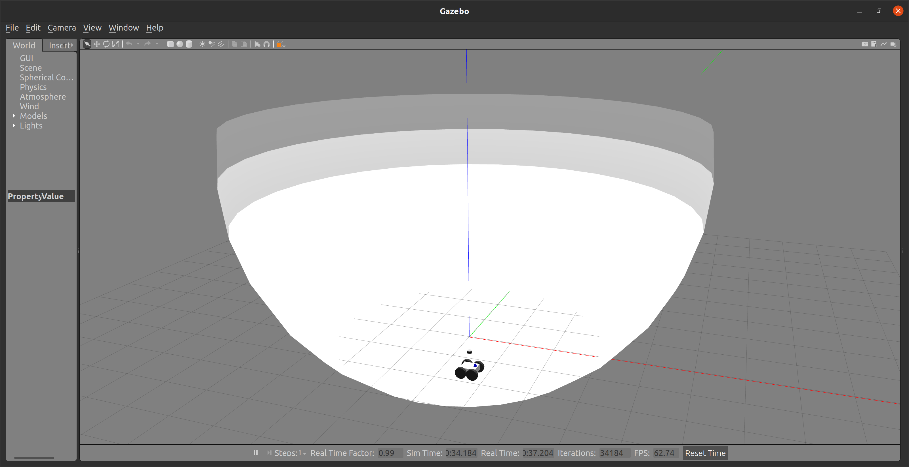
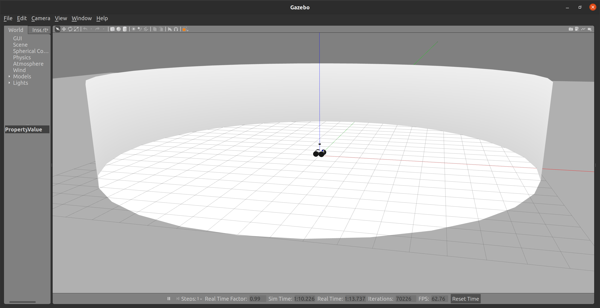
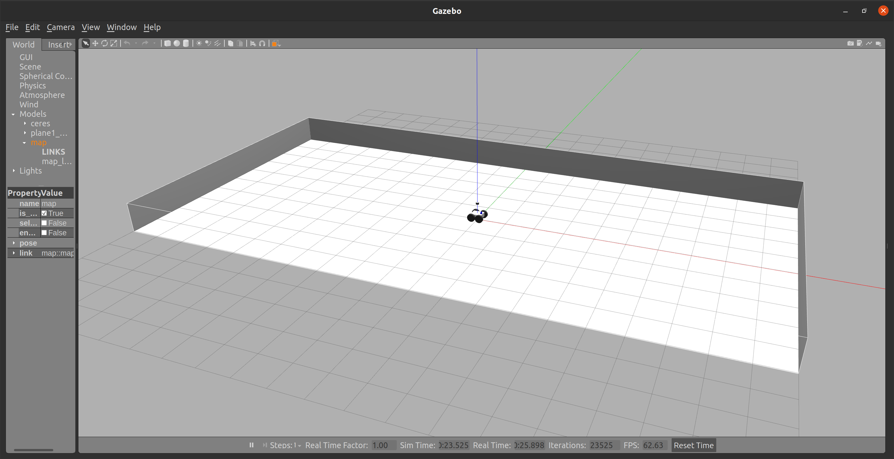
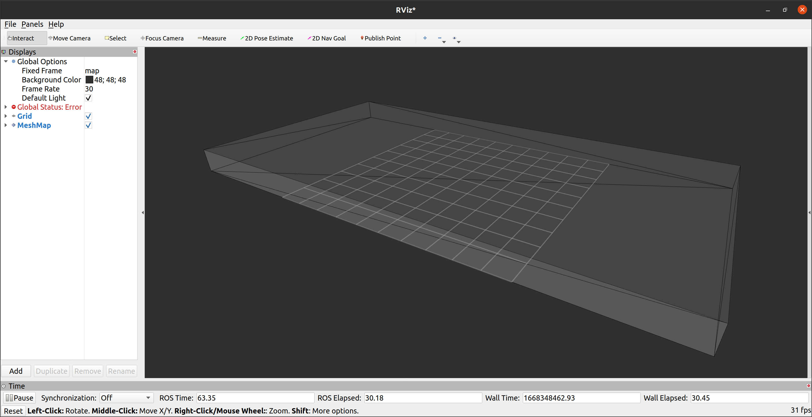

# rmcl_examples

Examples to test the [rmcl](https://github.com/uos/rmcl) ROS package.

## Worlds, Maps and Simulation

In the `maps` folder there are several triangle meshes that can be used as a map for the robot.
The robot and each map can be loaded into one simulation by calling

```console
$ ros2 launch rmcl_examples start_robot_launch.py map:=tray
```

The map can be changed by either changing the launch file's default arguments or via command line.

After that, try to visualize the triangle mesh map via RViz.
[rmcl](https://github.com/uos/rmcl) itself does not provide any mesh visualization tools.
I myself use the RViz plugin of the mesh_tools: https://github.com/naturerobots/mesh_tools (Branch: humble)

```
$ ros2 launch rmcl_examples rviz.launch map:=tray
```

The results should look as follows:

|  Gazebo  |  RViz  |
|:--------:|:------:|
|  |  |
|  |  |
|  |  |
|  |  |


### Description

We present a collection of environments designed to benchmark localization algorithms, each posing a unique and challenging problem.
Most of these environments are intentionally constructed to prevent unique localization solutions.
Instead, the objective is to achieve the best possible reduction of the belief state informed by the sensor data.
A localization method is considered to fail if it produces a single definitive solution when multiple locations are equally probable.
The following table briefly summarize the best possible localization outcome for a robot equipped with motor encoders, an IMU and a 3D LiDAR:


|  World Name | Best possible localization |
|:------------|:-------------------------------------------------------|
|  `cube`     | 4 modes in your belief state probability distribution  |
|  `sphere`   | Equal probabilty for every pose located on the surface |
|  `cylinder` | Circular probability distribution |
|  `tray`     | Similar to cube but rectengular: 2 most probable modes. Dependent on the system and sensor noise, two more slightly less probable modes could exist. |
|  `corridor` | State: anywhere in the center of the corridor. Belief state: same probability everywhere in the center of the corridor |
|  `trays`    | 3x3 grid of `tray` model. Same most probable modes as for the `tray` environment but symmetrically distributed over a 3x3 grid. |
|  `avz`      | Old office floor of Osnabrück University in the AVZ building. Real world sample, still many ambiguities such as same sized rooms. |


## MICP Localization

To start MICP-L, run

```
$ ros2 launch rmcl_examples rmcl_micp.launch map:=tray
```

Again, the map has to match the maps that have been used with the simulation and visualization.
For different settings of MICP-L you can pass a configuration file to the launch file as follows

```
$ ros2 launch rmcl_examples rmcl_micp.launch map:=tray config:=/path/to/config 
```

You can find examples for such configuration files in the `config` folder. After starting MICP-L, the outputs should look as follows:

```console
MICP initiailized

-------------------------
    --- BACKENDS ---    
-------------------------
Available combining units:
- CPU
- GPU
Selected Combining Unit: CPU

Available raytracing backends:
- Embree (CPU)
- Optix (GPU)

MICP load params

-------------------------
     --- FRAMES ---      
-------------------------
- base:			base_footprint
- odom:			odom_combined
  - base -> odom:	yes
- map:			map
Estimating: base_footprint -> map
Providing: odom_combined -> map

-------------------------
     --- SENSORS ---     
-------------------------
- velodyne
  - data:		Topic
    - topic:		/velodyne/points
    - msg:		sensor_msgs/PointCloud2
    - data:		yes
    - frame:		velodyne
  - model:		Params
  - type:		spherical - loaded
  - micp:
    - backend:		embree
MICP load params - done. Valid Sensors: 1
TF Rate: 50
Waiting for pose guess...
```

After that you can set a pose in RViz via `2D Pose Estimate` and see the robot localizing itself given the range measurements of the Velodyne LiDaR. Alternatively, you can use the `Mesh Pose Guess` tool of `mesh_tools` to provide a pose guess on the mesh.


If visualizations are enabled in the micp config file, the ray casting correspondences (RCC) can be visualized per sensor `X` as marker on the topic `micp_localization/sensors/X/correspondences`.

")

