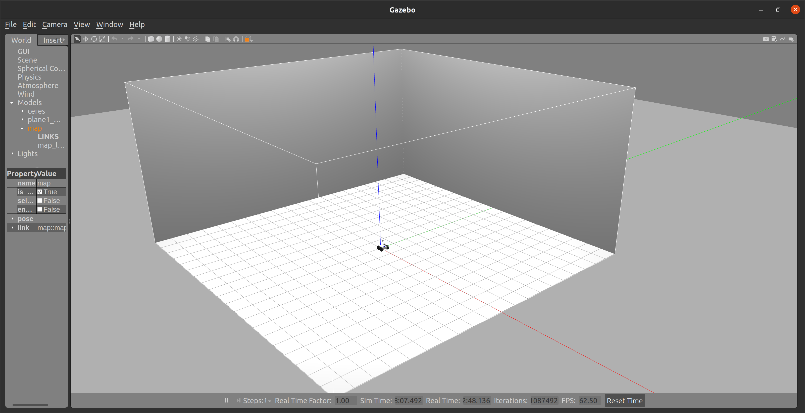
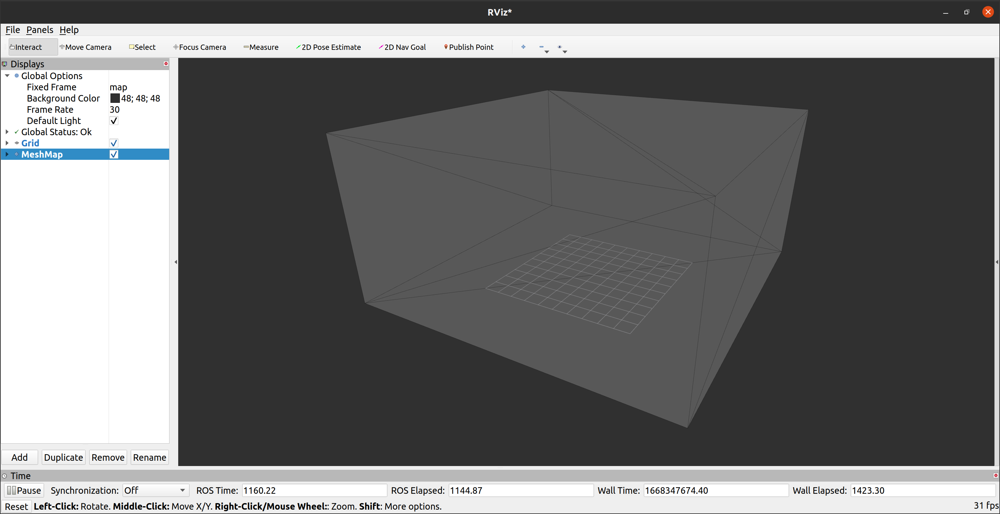
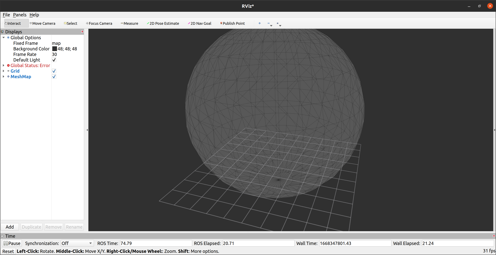
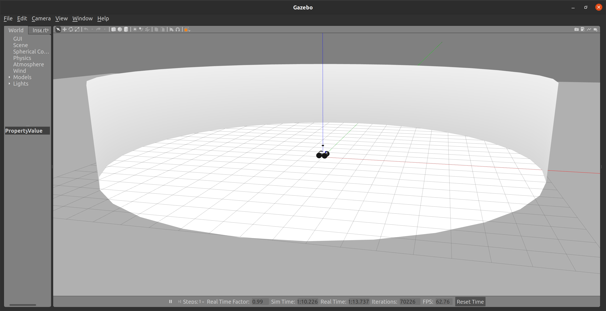
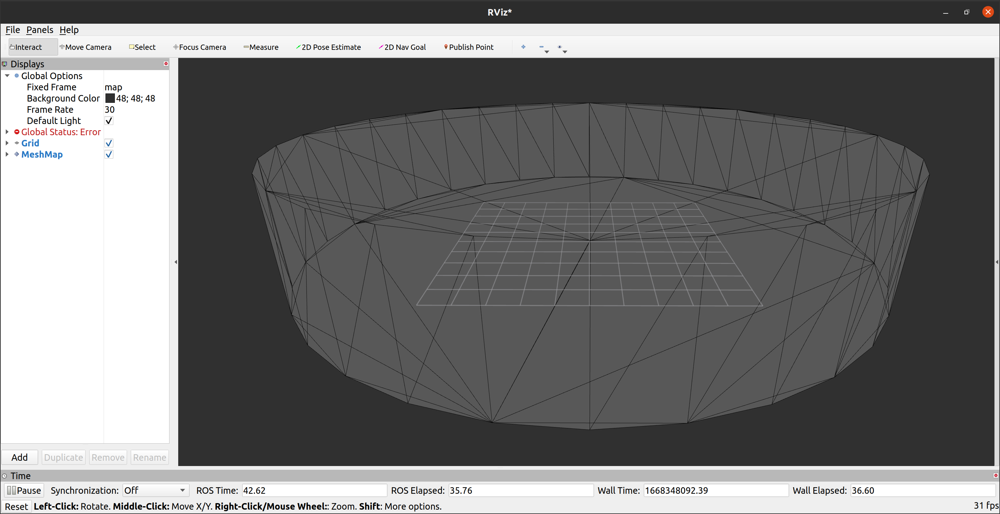
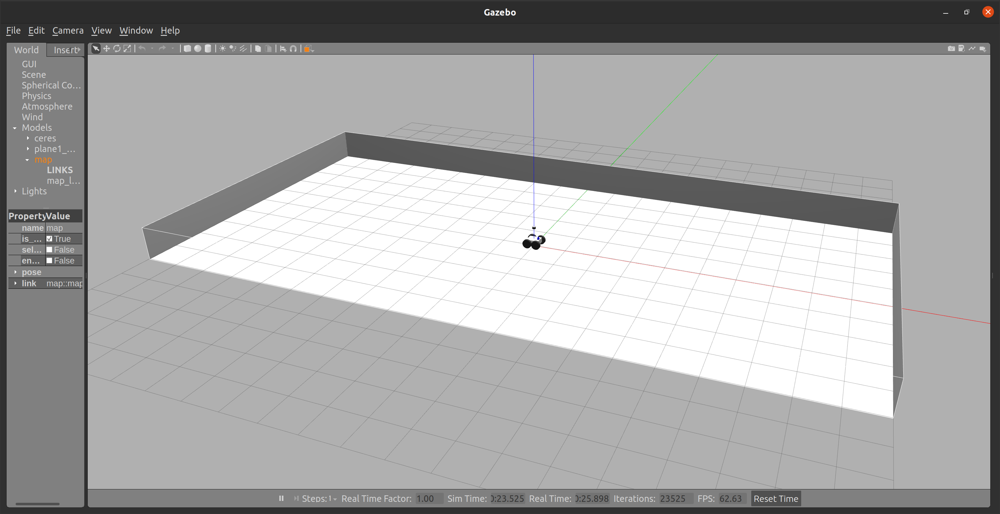

# rmcl_example

Examples to test the [rmcl](https://github.com/uos/rmcl) ROS package.

## Worlds, Maps and Simulation

In the `maps` folder there are several triangle meshes that can be used as a map for the robot.
The robot and each map can be loaded into one simulation by calling

```console
$ ros2 launch rmcl_example start_robot_launch.py map:=tray
```

The map can be changed by either changing the launch file's default arguments or via command line.

After that, try to visualize the triangle mesh map via RViz.
[rmcl](https://github.com/uos/rmcl) itself does not provide any mesh visualization tools.
I myself use the RViz plugin of the mesh_tools: https://github.com/naturerobots/mesh_tools

```
$ ros2 launch rmcl_example rviz.launch map:=tray
```

The results should look as follows:

|  Gazebo  |  RViz  |
|:--------:|:------:|
|  |  |
|  |  |
|  |  |
|  |  |

## MICP Localization

To start MICP-L, run

```
$ ros2 launch rmcl_example rmcl_micp.launch map:=tray
```

Again, the map has to match the maps that have been used with the simulation and visualization.
For different settings of MICP-L you can pass a configuration file to the launch file as follows

```
$ ros2 launch rmcl_example rmcl_micp.launch map:=tray config:=/path/to/config 
```

You can find examples for such configuration files in the `config` folder. After starting MICP-L, the outputs should look as follows:

```console
MICP initiailized

-------------------------
    --- BACKENDS ---    
-------------------------
Available combining units:
- CPU
- GPU
Selected Combining Unit: CPU

Available raytracing backends:
- Embree (CPU)
- Optix (GPU)

MICP load params

-------------------------
     --- FRAMES ---      
-------------------------
- base:			base_footprint
- odom:			odom_combined
  - base -> odom:	yes
- map:			map
Estimating: base_footprint -> map
Providing: odom_combined -> map

-------------------------
     --- SENSORS ---     
-------------------------
- velodyne
  - data:		Topic
    - topic:		/velodyne/points
    - msg:		sensor_msgs/PointCloud2
    - data:		yes
    - frame:		velodyne
  - model:		Params
  - type:		spherical - loaded
  - micp:
    - backend:		embree
MICP load params - done. Valid Sensors: 1
TF Rate: 50
Waiting for pose guess...
```

After that you can set a pose in RViz via `2D Pose Estimate` and see the robot localizing itself given the range measurements of the Velodyne LiDaR.


If visualizations are enabled in the micp config file, the ray casting correspondences (RCC) can be visualized per sensor `X` as marker on the topic `micp_localization/sensors/X/correspondences`.

")

